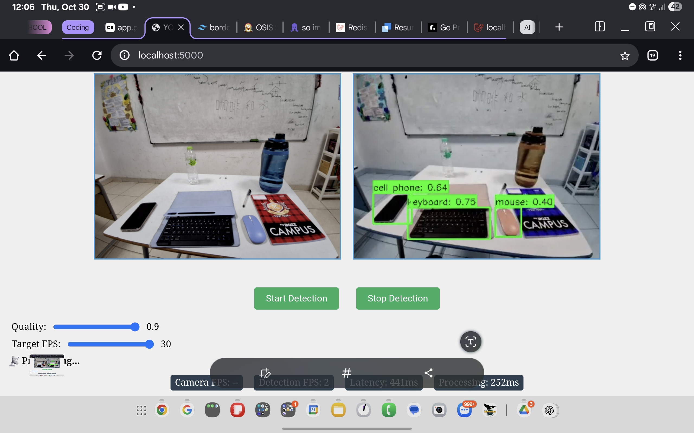

# YOLOv8 Real-Time Object Detection

This project provides a real-time object detection application using YOLOv8, Flask, and SocketIO. It captures video from a webcam, sends frames to a server for processing, and displays the results with bounding boxes in a web interface.

## Features

- **Real-time object detection:** Uses the YOLOv8 model to detect objects in real-time.
- **Web-based interface:** Provides a simple web interface to view the camera feed and the detection results.
- **Flask and SocketIO:** Uses Flask for the web server and SocketIO for real-time communication between the client and server.
- **Optimized for performance:** Includes optimizations such as model fusion and CUDA support for faster inference.
- **Dynamic quality and FPS control:** Allows adjusting the image quality and target FPS from the web interface.



## Requirements

- Python 3.7+
- Flask
- Flask-SocketIO
- OpenCV
- Ultralytics
- NumPy
- Pillow

## Installation

1. **Clone the repository:**
   ```bash
   git clone https://github.com/yeahbois/opencv-flaskai.git
   cd opencv-flaskai
   ```

2. **Install the dependencies:**
   ```bash
   pip install -r requirements.txt
   ```

3. **Download the YOLOv8 models:**
   The application uses `yolov8n.pt` by default. This model is included in the repository.

## Usage

1. **Run the application:**
   ```bash
   python app.py
   ```

2. **Open your web browser:**
   Navigate to `http://0.0.0.0:5000` to view the application.

3. **Start detection:**
   Click the "Start Detection" button to begin real-time object detection.

## Technologies Used

- **YOLOv8:** For object detection.
- **Flask:** As the web framework.
- **SocketIO:** for real-time communication.
- **OpenCV:** for image processing.
- **Pillow:** For image handling.
- **HTML/CSS/JavaScript:** For the frontend.
